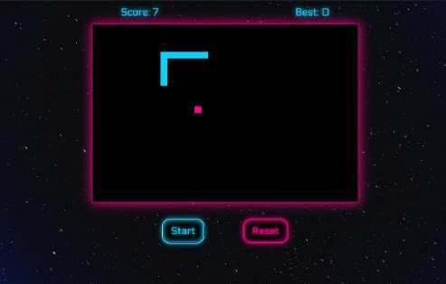

# Project-1-SNAKE

This project is a version of the classic mobile game Snake. 

### How To Play
It is a single player game where the user directs the snake towards the food (dot) on screen using the arrow keys. Once the food is reached, a new block is added to the current snake and another food block will appear at a random location on screen. The game ends when the snake either moves into the border or into itself. The goal is to make the snake as large as possible before that happens. 

Let's see how high you can score!

### Languages
- Javascript
- CSS
- HTML

### Challenges
- Creating smooth transition as the snake moves along the screen
- Adding audio for background music and game over
- Creating the food logic for randomized location

### Credits
- W3Schools
- MDN
- Stack Overflow
- [A game of Snake written in JavaScript](https://www.youtube.com/watch?v=Je0B3nHhKmM&t=768s)
- [Coding Snake in JavaScript Complete Tutorial Every Step Explained with HTML5 Canvas](https://www.youtube.com/watch?v=7Azlj0f9vas&t=934s)
- [Create a neon button with reflection using CSS](https://www.youtube.com/watch?v=6xNcXwC6ikQ)
